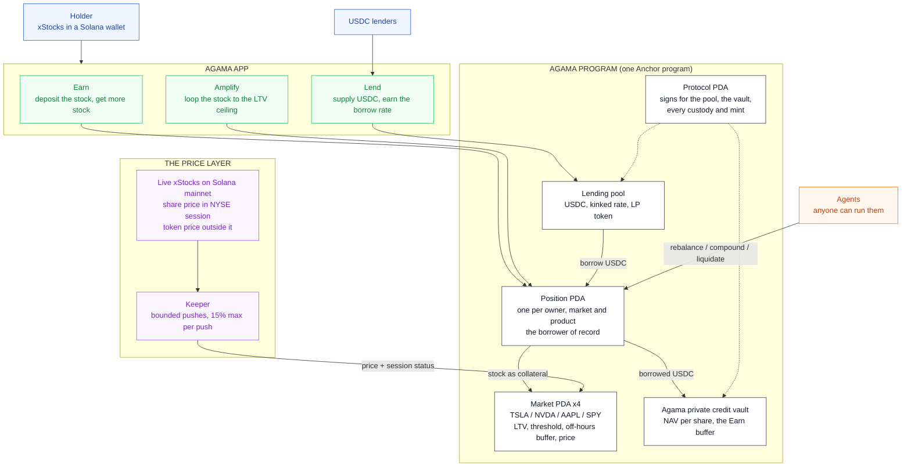

# Agama: make tokenized stocks productive on Solana

Deposit a tokenized stock, get more of it back. Live on **Solana devnet**.

The xStocks (TSLAx, NVDAx, AAPLx, SPYx and the rest) are native SPL tokens on
Solana and trade around the clock, yet a holder can only hold them. Agama turns
them into a position that grows: deposit the stock, the protocol borrows USDC
against it, puts the USDC to work in the Agama private credit vault, and
permissionless agents turn the yield back into **more of the stock**. What
grows is your share count, not a stablecoin balance.

This is the same product as [Agama on X Layer](https://github.com/agamafinance/agama-xlayer),
rewritten from Solidity into one Anchor program.

## Architecture



## What it does

- **Earn.** One deposit and one slider. The program borrows USDC up to the
  level you pick and puts it in the vault, in the same instruction. From then on
  the agents hold the level: the stock rises, they borrow the difference; it
  falls, they repay out of the vault shares, **never by selling your stock**.
  The yield above the debt is bought back as more stock (`compound`).
- **Amplify.** One slider. `amplify_open` borrows against the stock and buys
  more of the same stock in one instruction, no loop of hops: a loop at L times
  carries an LTV of `(L - 1) / L`, so the market's own LTV is the ceiling
  (1.43x on TSLA and NVDA, 1.54x on AAPL, 2x on SPY). The agents hold the
  multiple both ways.
- **Lend.** Supply USDC, receive the pool's LP token, earn the kinked borrow
  rate.
- **The buffer goes before the liquidator.** `liquidate` first repays out of
  the position's vault shares; only if that does not restore health does the
  liquidator repay half the debt and take stock at a 5% bonus.
- **Priced around the clock, honestly.** In NYSE session the keeper relays the
  share price; outside it, the xStock token's own price on Solana, flagged
  off-hours so LTV and threshold both tighten by 5 points. A push can move a
  price by 15% at most, publish times only move forward, and only a stale price
  stops a borrow.
- **No buttons for the automation.** Every position records which agent last
  acted, what it did and when. `rebalance`, `compound` and `liquidate` take any
  signer; the keeper is one caller among many.

### Solana, not a port line by line

On X Layer every user gets an EIP-1167 account contract and the routers call
into it. On Solana the account is a PDA (`position`, seeded by owner, market and
product), so there is nothing to clone and no router to trust: the owner's
signature derives the address. The X Layer `compoundIntoStock` needed the caller
to pass the exact swap amount and calldata, with an on-chain slippage floor
against griefing; here the swap is priced inside the instruction off the same
oracle, so an agent has nothing to choose and nothing to skim.

## Confidential balances

Every token Agama mints (USDC, the four stocks, the LP token) is a Token-2022
mint with the **confidential transfer extension**. A holder can move any of
them into an encrypted balance and send them to anyone without the amount ever
appearing on chain: balances and transfer amounts are ElGamal ciphertexts, and
the ZK proofs that keep them honest (no negative balances, no minted value)
are checked on chain by Solana's ZK ElGamal proof program.

| | Public | Private |
|---|---|---|
| What you hold of each token | | encrypted, only your keys read it |
| Sending to someone else | | amount hidden from everyone but the two of you |
| Depositing into Earn, Amplify, Lend | amount visible | |
| What comes back on close or withdraw | amount visible, then shielded again | |
| Positions (collateral, debt, target) | program state, readable by anyone | |

A program cannot price a loan it cannot read, so positions stay public: what
the encryption hides is everything around them, how much you hold, where it
goes, who you pay. The mints have no auditor key and no authority that could
add one later.

- **Keys.** Derived from one wallet signature over `solana-conf-bal/v1`, the
  standard every Token-2022 client uses, so the same wallet reads the same
  balances in any app.
- **Cost.** Shielding is two transactions (deposit, apply). A private send
  is five and an unshield four: the range and equality proofs do not fit in one
  transaction, so they are verified into context accounts first and closed
  afterwards, rent back.
- **Rounding never reaches the wallet.** A holder whose USDC is all private has
  zero public USDC, so `earn_close` writes off a rounding gap of up to 0.0001
  USDC between the vault shares and the debt instead of asking the wallet for it.
- **Tooling.** Proofs come from `@solana/zk-sdk` (Anza's WASM build of
  `solana-zk-sdk`) through the Kit client `@solana-program/token-2022/confidential`.
  Local validators need agave 4.3 or later (3.1 rejects these proofs) and
  devnet's Token-2022 build (the genesis copy predates the instruction layout).

`pnpm private-e2e` runs it: shield, private sends, a stranger's view, unshield
into Earn, close and shield back, lend from private, every balance decrypted
and checked exactly.

## Where it lives

| | |
|---|---|
| Status | Live on devnet: Token-2022 with confidential balances. The deployed bytes match a build of this branch. |
| Program | [`6YdZN72p68ynpGH1SwZ86EseFokch6zPAQPAq9NxPY7D`](https://explorer.solana.com/address/6YdZN72p68ynpGH1SwZ86EseFokch6zPAQPAq9NxPY7D?cluster=devnet) (devnet) |
| Every address | [`deployments/devnet.json`](deployments/devnet.json) |
| IDL | [`idl/agama_solana.json`](idl/agama_solana.json) |
| Test funds | `faucet_usdc` mints 10,000 USDC, `faucet_stock` 10 shares of a market. Devnet SOL at https://faucet.solana.com |

## Devnet, said plainly

- **Stand-in tokens.** USDC and the four stocks are mints the program controls,
  with a public faucet. The prices are real: they track the live xStocks.
- **Swaps settle at the oracle price minus 5 bps.** Devnet has no xStock
  liquidity. On mainnet that leg is a Jupiter route.
- **The vault's coupons are minted.** There is no credit book on devnet, so when
  the vault pays out more than it took in, the difference is minted and counted
  in `coupons_paid`. It is the only place the program creates dollars.
- **The keeper is trusted for the session flag**, bounded for the price.
- **Token-2022 throughout**, like the mainnet xStocks.
- Pyth's public Hermes endpoint now answers 401 without an API key, so the
  keeper reads Jupiter's price API, which returns both the token price and the
  underlying share's price for every xStock.

## Run it

```bash
anchor build                      # or: cargo build-sbf --manifest-path programs/agama-solana/Cargo.toml
cargo test                        # 12 LiteSVM flows against the built program, plus unit tests
./scripts/check.sh                # everything CI runs, before pushing
pnpm install
pnpm setup                        # initialize, 4 markets, first prices, seed the pool (idempotent)
pnpm e2e                          # 9 real transactions on devnet from a fresh wallet
pnpm e2e:local                    # throwaway validator: setup, the e2e, the agents through
                                  # the real keeper with prices moved on purpose (17 checks),
                                  # then the private path (12 checks). VALIDATOR=agave 4.3+
pnpm state                        # live pool, vault, prices and their age, positions, keeper
pnpm keeper                       # prices + agents, every 30 s
```

The LiteSVM suite (`programs/agama-solana/tests/flows.rs`) covers: Earn opening
at the level with the USDC landing in the vault; the agents holding the level
both ways without touching the stock; half a year of yield coming back as more
stock and a close returning it; a close after interest outran the yield taking
the shortfall from the wallet; Amplify looping to the multiple, holding it
through a rally and a drop, and unwinding; the buffer going before the
liquidator; an Amplify loop liquidated at the bonus; lenders earning the rate
and not withdrawing lent cash; the price bounds (keeper only, 15% per push,
publish time, staleness, off-hours terms); the slider.

## The app

`web/` is the Agama app shell with Solana as its platform: Earn, Amplify, Lend,
Portfolio and a one-transaction Faucet under `/solana`, for Phantom, Solflare,
Backpack or any injected wallet. `cd web && pnpm dev` serves it on
http://localhost:3031/solana. `web/scripts/ui-e2e.mjs` drives it in a headless
browser with a throwaway signer, every click a real devnet transaction: faucet,
Earn open, the slider, Amplify open and close, Lend supply and withdraw, Earn
close.

## Instructions

| | Who | What |
|---|---|---|
| `initialize`, `add_market`, `set_params`, `set_market` | admin | Protocol, mints, pool and vault accounts; markets and their terms |
| `push_price` | keeper | Price, publish time, session flag; bounded |
| `faucet_usdc`, `faucet_stock` | anyone | Devnet funds |
| `supply`, `withdraw` | lender | USDC in and out of the pool, LP token |
| `earn_deposit`, `earn_set_target`, `earn_close` | owner | Open or top up at a level, move the slider, close |
| `amplify_open`, `amplify_close` | owner | Loop to a multiple in one instruction, unwind |
| `rebalance`, `compound`, `liquidate`, `poke` | anyone | The agents |
