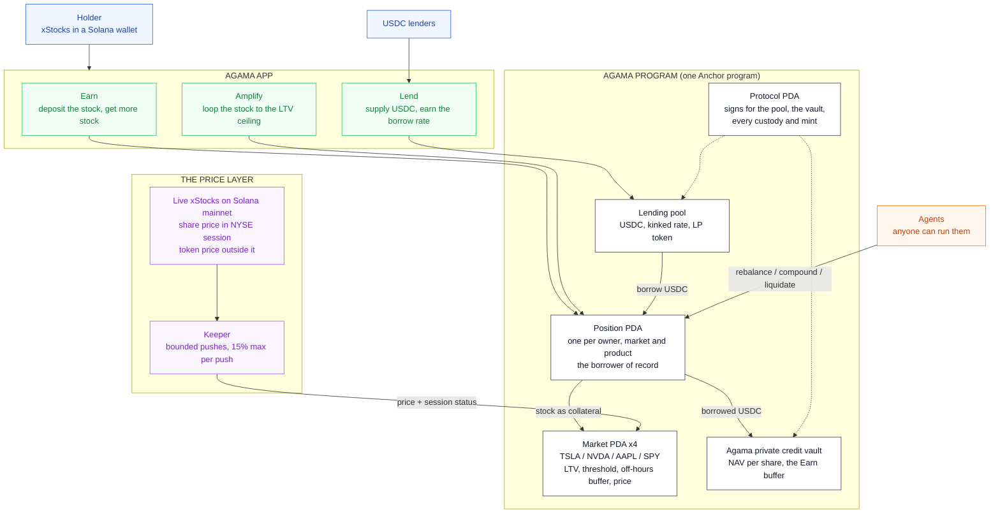

# Agama: make tokenized stocks productive on Solana

Deposit a tokenized stock, get more of it back. Live on **Solana devnet**.

The xStocks (TSLAx, NVDAx, AAPLx, SPYx, QQQx, GOOGLx, MSFTx, AMZNx, METAx) and
Streamex's gold-backed GLDY are native tokens on Solana and trade around the
clock, yet a holder can only hold them. Agama turns
them into a position that grows: deposit the stock, the protocol borrows USDC
against it, puts the USDC to work in the Agama private credit vault, and
permissionless agents turn the yield back into **more of the stock**. What
grows is your share count, not a stablecoin balance.

This is the same product as [Agama on X Layer](https://github.com/agamafinance/agama-xlayer),
rewritten from Solidity into one Anchor program.

## Architecture



## What it does

- **Earn.** One deposit and one slider. The program borrows USDC up to the
  level you pick and puts it in the vault, in the same instruction. From then on
  the agents hold the level: the stock rises, they borrow the difference; it
  falls, they repay out of the vault shares, **never by selling your stock**.
  The yield above the debt is bought back as more stock (`compound`).
- **Amplify.** One slider. `amplify_open` borrows against the stock and buys
  more of the same stock in one instruction, no loop of hops: a loop at L times
  carries an LTV of `(L - 1) / L`, so the market's own LTV is the ceiling
  (1.43x on TSLA and NVDA, 1.54x on AAPL, 2x on SPY). The agents hold the
  multiple both ways.
- **Lend.** Supply USDC, receive the pool's LP token, earn the kinked borrow
  rate.
- **The buffer goes before the liquidator.** `liquidate` first repays out of
  the position's vault shares; only if that does not restore health does the
  liquidator repay half the debt and take stock at a 5% bonus.
- **Priced by Chainlink CRE, around the clock, honestly.** A CRE workflow
  prices every market (see below). In NYSE session it takes the share price;
  outside it, the xStock token's own price on Solana, flagged off-hours so LTV
  and threshold both tighten by 5 points. A price can move 15% at most per
  update, publish times only move forward, and only a stale price stops a
  borrow.
- **No buttons for the automation.** Every position records which agent last
  acted, what it did and when. `rebalance`, `compound` and `liquidate` take any
  signer; the keeper is one caller among many.

### Solana, not a port line by line

On X Layer every user gets an EIP-1167 account contract and the routers call
into it. On Solana the account is a PDA (`position`, seeded by owner, market and
product), so there is nothing to clone and no router to trust: the owner's
signature derives the address. The X Layer `compoundIntoStock` needed the caller
to pass the exact swap amount and calldata, with an on-chain slippage floor
against griefing; here the swap is priced inside the instruction off the same
oracle, so an agent has nothing to choose and nothing to skim.

## Chainlink CRE: prices and agents

Two Chainlink Runtime Environment workflows run the protocol. `agama-prices`
prices the markets; `agama-agents` runs the agents. No keeper is left.

### agama-prices

```
cron, every minute
  each DON node, over HTTP:
    Jupiter price API   the 9 xStocks: the token's own price and the share's
    DexScreener         the deepest USDC pair of each xStock: a second,
                        independent token price (Raydium, Meteora...)
    Solana mainnet RPC  Orca's GLDY/USDC whirlpool account, sqrt_price at offset 65
    gold spot           a guard on that thin pool (3% band)
  consensus             median of every field across the nodes
  decision, DON clock   in session or not (NYSE hours, gold 24/5), which source
  Solana write          a heartbeat, then one signed report per 3 markets
    -> Keystone Forwarder -> agama.on_report -> markets priced
```

- **No single source decides.** An xStock's token price needs Jupiter and the
  DEX pair to agree within 2% (then their mean), or comes from the one that
  answered; if they disagree, the market is skipped this run and keeps its
  last price. In session the share price leads only while it is within 3% of
  that token price. GLDY needs the Orca pool within 3% of gold spot, or falls
  back to spot.
- **Chainlink Data Streams next.** Chainlink publishes US equities streams on
  Solana; access is requested. The workflow will fetch them as the primary
  price, with the current sources as the cross-check.
- **The receiver checks who is calling.** `on_report` requires the configured
  forwarder state, the forwarder's authority PDA for this program as signer,
  and, once set, the workflow owner from the report metadata. Then it decodes
  the Borsh `PriceReport` and prices the markets listed after `cre` in the
  accounts, with the same `apply_price` the keeper used.
- **One bad price does not sink the report.** A price older than the one
  already there, or past the 15% bound, is skipped with a `PriceSkipped` event;
  the other markets of the report still update.
- **Three markets per report.** A Solana transaction leaves the forwarder about
  265 bytes once its accounts are paid, and every market is another account.
- **Why a heartbeat.** On devnet the first write of a run went out minutes after
  the trigger and never landed, three runs out of three. The run now opens with
  an empty report that only stamps `cre.last_report_at`, which doubles as the
  liveness the app shows.
- **Where it runs today.** The organisation is still gated for CRE deploys, so
  the workflow runs through the CRE simulator (`cre/run-devnet.sh`, every
  minute under launchd), which executes the same WASM, does the same HTTP and
  consensus steps, and broadcasts through Chainlink's **mock** forwarder on
  devnet. The mock does not verify DON signatures and the simulator puts a
  placeholder workflow owner in the metadata, so until the DON runs it, reports
  are trusted only as far as the per-update bounds. With Deploy Access:
  `cre workflow deploy agama-prices --target production-settings`, then
  `CRE_MODE=production CRE_WORKFLOW_OWNER=0x... pnpm setup` points the receiver
  at the live Keystone Forwarder and pins the owner.
- **Tested against Chainlink's own forwarder.** The LiteSVM suite loads the mock
  forwarder program (dumped from devnet by `scripts/fetch-fixtures.sh`) and
  sends real reports through it: prices applied, a 20% jump skipped while the
  rest of the report lands, a stale report skipped, another workflow owner, a
  forged `forwarder_authority` and a market missing from the accounts refused.
  `cre/simulate-local.sh` runs the whole workflow against a local validator
  with the forwarder cloned in.

### agama-agents

```
cron, every minute (at :30)
  each DON node, over HTTP:
    getProgramAccounts   every Agama position (confirmed, so new ones count)
    for each position    build compound (Earn) and rebalance, sign with the
                         agent key from CRE secrets, sendTransaction
    RPC preflight        AlreadyOnTarget / NothingToCompound refused for free
  consensus              median of positions, acted, on target, failed
```

- **Why not a report through the forwarder.** An agent action needs ten
  accounts; a CRE Solana write has no address lookup tables yet and leaves
  about 265 bytes once accounts are paid. The instructions are permissionless,
  so the workflow simply is one of the signers anyone could be.
- **Under the DON** every node sends its own signed copy: the first to land
  acts, the others fail preflight because the position is on target by then.
- The agent key only pays fees; positions record it as `last_agent`, which
  the app shows. Checked end to end in `cre/simulate-local.sh`: a position at
  20%, TSLA up 10%, one workflow run, the CRE agent key borrowed the difference.

The old keeper (`scripts/keeper.ts`) stays as a fallback that anyone can run,
and `push_price` as a fallback price path, bounded the same way.

## Confidential balances

Every token Agama mints (USDC, the four stocks, the LP token) is a Token-2022
mint with the **confidential transfer extension**. A holder can move any of
them into an encrypted balance and send them to anyone without the amount ever
appearing on chain: balances and transfer amounts are ElGamal ciphertexts, and
the ZK proofs that keep them honest (no negative balances, no minted value)
are checked on chain by Solana's ZK ElGamal proof program.

| | Public | Private |
|---|---|---|
| What you hold of each token | | encrypted, only your keys read it |
| Sending to someone else | | amount hidden from everyone but the two of you |
| Depositing into Earn, Amplify, Lend | amount visible | |
| What comes back on close or withdraw | amount visible, then shielded again | |
| Positions (collateral, debt, target) | program state, readable by anyone | |

A program cannot price a loan it cannot read, so positions stay public: what
the encryption hides is everything around them, how much you hold, where it
goes, who you pay. The mints have no auditor key and no authority that could
add one later.

- **Keys.** Derived from one wallet signature over `solana-conf-bal/v1`, the
  standard every Token-2022 client uses, so the same wallet reads the same
  balances in any app.
- **Cost.** Shielding is two transactions (deposit, apply). A private send
  is five and an unshield four: the range and equality proofs do not fit in one
  transaction, so they are verified into context accounts first and closed
  afterwards, rent back.
- **Rounding never reaches the wallet.** A holder whose USDC is all private has
  zero public USDC, so `earn_close` writes off a rounding gap of up to 0.0001
  USDC between the vault shares and the debt instead of asking the wallet for it.
- **Tooling.** Proofs come from `@solana/zk-sdk` (Anza's WASM build of
  `solana-zk-sdk`) through the Kit client `@solana-program/token-2022/confidential`.
  Local validators need agave 4.3 or later (3.1 rejects these proofs) and
  devnet's Token-2022 build (the genesis copy predates the instruction layout).

`pnpm private-e2e` runs it: shield, private sends, a stranger's view, unshield
into Earn, close and shield back, lend from private, every balance decrypted
and checked exactly.

## Where it lives

| | |
|---|---|
| Status | Live on devnet: Token-2022 with confidential balances. The deployed bytes match a build of this branch. |
| Program | [`6YdZN72p68ynpGH1SwZ86EseFokch6zPAQPAq9NxPY7D`](https://explorer.solana.com/address/6YdZN72p68ynpGH1SwZ86EseFokch6zPAQPAq9NxPY7D?cluster=devnet) (devnet) |
| Every address | [`deployments/devnet.json`](deployments/devnet.json) |
| IDL | [`idl/agama_solana.json`](idl/agama_solana.json) |
| Test funds | `faucet_usdc` mints 10,000 USDC, `faucet_stock` 10 shares of a market. Devnet SOL at https://faucet.solana.com |

## Devnet, said plainly

- **Stand-in tokens.** USDC, the nine xStocks and GLDY are mints the program
  controls, with a public faucet: no xStock or GLDY faucet exists on devnet, and
  the real GLDY is permissioned (frozen-by-default accounts behind Streamex's
  KYC allowlist). The prices are real: they track the live tokens.
- **Swaps settle at the oracle price minus 5 bps.** Devnet has no xStock
  liquidity. On mainnet that leg is a Jupiter route.
- **The vault's coupons are minted.** There is no credit book on devnet, so when
  the vault pays out more than it took in, the difference is minted and counted
  in `coupons_paid`. It is the only place the program creates dollars.
- **The session flag comes from the workflow's clock**, the price is bounded.
- **Token-2022 throughout**, like the mainnet xStocks.
- Pyth's public Hermes endpoint now answers 401 without an API key, so the
  workflow reads Jupiter's price API, which returns both the token price and the
  underlying share's price for every xStock. Orca's API answers 403 to the CRE
  HTTP client, so GLDY is read from the whirlpool account itself.

## Run it

```bash
anchor build                      # or: cargo build-sbf --manifest-path programs/agama-solana/Cargo.toml
./scripts/fetch-fixtures.sh && cargo test  # 14 LiteSVM flows, incl. CRE through Chainlink's forwarder
./scripts/check.sh                # everything CI runs, before pushing
pnpm install
pnpm setup                        # initialize, 4 markets, first prices, seed the pool (idempotent)
pnpm e2e                          # 9 real transactions on devnet from a fresh wallet
pnpm e2e:local                    # throwaway validator: setup, the e2e, the agents through
                                  # the real keeper with prices moved on purpose (17 checks),
                                  # then the private path (12 checks). VALIDATOR=agave 4.3+
pnpm state                        # live pool, vault, prices and their age, positions, keeper
./cre/run-devnet.sh               # one run of the CRE price workflow on devnet
./cre/run-devnet.sh agama-agents  # one run of the CRE agents workflow
pnpm keeper                       # fallback keeper, if CRE is down
VALIDATOR=... ./cre/simulate-local.sh  # the workflow against a local validator
```

The LiteSVM suite (`programs/agama-solana/tests/flows.rs`) covers: Earn opening
at the level with the USDC landing in the vault; the agents holding the level
both ways without touching the stock; half a year of yield coming back as more
stock and a close returning it; a close after interest outran the yield taking
the shortfall from the wallet; Amplify looping to the multiple, holding it
through a rally and a drop, and unwinding; the buffer going before the
liquidator; an Amplify loop liquidated at the bonus; lenders earning the rate
and not withdrawing lent cash; the price bounds (keeper only, 15% per push,
publish time, staleness, off-hours terms); the slider.

## The app

`web/` is the Agama app shell with Solana as its platform: Earn, Amplify, Lend,
Portfolio and a one-transaction Faucet under `/solana`, for Phantom, Solflare,
Backpack or any injected wallet. `cd web && pnpm dev` serves it on
http://localhost:3031/solana. `web/scripts/ui-e2e.mjs` drives it in a headless
browser with a throwaway signer, every click a real devnet transaction: faucet,
Earn open, the slider, Amplify open and close, Lend supply and withdraw, Earn
close.

## Instructions

| | Who | What |
|---|---|---|
| `initialize`, `add_market`, `set_params`, `set_market` | admin | Protocol, mints, pool and vault accounts; markets and their terms |
| `on_report` | Chainlink Keystone Forwarder | CRE price reports, a few markets each; bounded |
| `set_cre` | admin | Forwarder program and state, workflow owner, simulation flag |
| `push_price` | keeper | Fallback price path; same bounds |
| `faucet_usdc`, `faucet_stock` | anyone | Devnet funds |
| `supply`, `withdraw` | lender | USDC in and out of the pool, LP token |
| `earn_deposit`, `earn_set_target`, `earn_close` | owner | Open or top up at a level, move the slider, close |
| `amplify_open`, `amplify_close` | owner | Loop to a multiple in one instruction, unwind |
| `rebalance`, `compound`, `liquidate`, `poke` | anyone | The agents |
