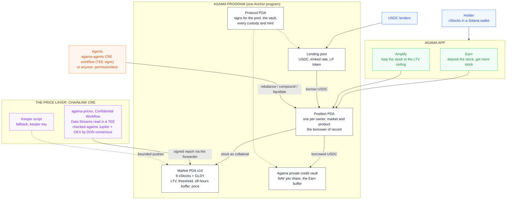

# Agama: make tokenized stocks productive on Solana

Deposit a tokenized stock, get more of it back. Live on **Solana devnet**.

The xStocks (TSLAx, NVDAx, AAPLx, SPYx, QQQx, GOOGLx, MSFTx, AMZNx, METAx) and
Streamex's gold-backed GLDY are native tokens on Solana and trade around the
clock, yet a holder can only hold them. Agama turns
them into a position that grows: deposit the stock, the protocol borrows USDC
against it, puts the USDC to work in the Agama private credit vault, and
permissionless agents turn the yield back into **more of the stock**. What
grows is your share count, not a stablecoin balance.

## TOKEN2049 Origins Hackathon

| | |
|---|---|
| Demo video | https://youtu.be/M5GXPA1J31w (2:22) |
| Live app | https://app.agama.finance/solana (Solana devnet, Phantom) |
| Program | [`6YdZN72p68ynpGH1SwZ86EseFokch6zPAQPAq9NxPY7D`](https://explorer.solana.com/address/6YdZN72p68ynpGH1SwZ86EseFokch6zPAQPAq9NxPY7D?cluster=devnet) on **devnet** |
| Example transaction | [CRE price report, Data Streams priced, written by the CRE CLI simulator (TEE and DON simulated) through Chainlink's devnet mock forwarder](https://explorer.solana.com/tx/2uzp2YfeoBrctTT8QLnJz96APhrqMQGraxK8baSnYDondFXhPRL5QxiCC6efFPBshFh4pzyYmUz6ZBkv85FZqnzG?cluster=devnet) |
| CRE evidence | [docs/CRE-EVIDENCE.md](docs/CRE-EVIDENCE.md): CLI output of both Confidential Workflows (TEE) |
| Tracks | Solana: Best Use of Solana; Chainlink: Best workflow with CRE |

**Try it without help.** Open the app with Phantom set to devnet (a little
devnet SOL from faucet.solana.com pays the fees), hit **Faucet** (USDC, the nine
stocks and GLDY land straight into your private balance), then **Earn**: pick a
stock, an amount and a level, deposit. Your position appears with its borrow,
its vault share and the agents keeping it on target; **Amplify** loops a stock
to a multiple; **Portfolio** decrypts your private balances on demand.

**What was built during the hackathon, and what existed before.** Every line
of this repository (the Anchor program, the Token-2022 confidential balance
flows, both CRE workflows, the Data Streams integration, the web app and the
tests) was written during the hackathon, on 6 and 7 October 2026. The first
commit lands the program and its tests in one piece (they were iterated
locally before the repository was created); the program's first transaction on
devnet is from 6 October, 05:00 UTC. The product design is not new: it is the one Agama shipped on
X Layer (EVM, Solidity) for OKX Dev Day,
[agamafinance/agama-xlayer](https://github.com/agamafinance/agama-xlayer). The
web app reuses Agama's visual identity and component styling from that app.

## Architecture



## What it does

- **Earn.** One deposit and one slider. The program borrows USDC up to the
  level you pick and puts it in the vault, in the same instruction. From then on
  the agents hold the level: the stock rises, they borrow the difference; it
  falls, they repay out of the vault shares, **never by selling your stock**.
  The yield above the debt is bought back as more stock (`compound`).
- **Amplify.** One slider. `amplify_open` borrows against the stock and buys
  more of the same stock in one instruction, no loop of hops: a loop at L times
  carries an LTV of `(L - 1) / L`, so the market's own LTV is the ceiling
  (1.43x on TSLA and NVDA, 1.54x on AAPL, 2x on SPY). The agents hold the
  multiple both ways.
- **Lend.** The pool is seeded by the protocol on devnet; the app no longer
  has a Lend tab, the `supply` / `withdraw` instructions remain.
- **The buffer goes before the liquidator.** `liquidate` first repays out of
  the position's vault shares; only if that does not restore health does the
  liquidator repay half the debt and take stock at a 5% bonus.
- **Priced by Chainlink CRE, around the clock, honestly.** A CRE workflow
  prices every market (see below). In NYSE session it takes the share price;
  outside it, the xStock token's own price on Solana, flagged off-hours so LTV
  and threshold both tighten by 5 points. A price moves 15% at most per
  update, publish times only move forward, and only a stale price stops a
  borrow.
- **No buttons for the automation.** Every position records which agent last
  acted, what it did and when. `rebalance`, `compound` and `liquidate` take any
  signer; the keeper is one caller among many.

### Solana, not a port line by line

On X Layer every user gets an EIP-1167 account contract and the routers call
into it. On Solana the account is a PDA (`position`, seeded by owner, market and
product), so there is nothing to clone and no router to trust: the owner's
signature derives the address. The X Layer `compoundIntoStock` needed the caller
to pass the exact swap amount and calldata, with an on-chain slippage floor
against griefing; here the swap is priced inside the instruction off the same
oracle, so an agent has nothing to choose and nothing to skim.

## Chainlink CRE: prices and agents

Two Chainlink Runtime Environment workflows run the protocol. `agama-prices`
prices the markets; `agama-agents` runs the agents. The keeper script stays
as a fallback: anyone can run its agent half (the instructions are
permissionless), its price half needs the keeper key.

**Both are Confidential Workflows.** Each handler runs in a TEE
(`handlerInTee`, AWS Nitro) and holds the one credential that must not leak:
the Chainlink Data Streams API key and secret for `agama-prices` (a
proprietary data credential: the HMAC signature is computed in the enclave),
the agent's signing key for `agama-agents`. Only decoded prices and signed
transactions leave the enclave. What should be public and agreed is asked of
the DONs through `usingTheDons()` (where each request physically runs is the
CRE TEE host's business, not this code's): the public price sources and the
chain reads under median or identical consensus, the report signature, the
Solana write. No node operator ever holds either secret. The decision itself
runs in the enclave, and a Data Streams price is used only when it agrees with
what the DON read (the xStock token within 3%, gold spot within 3%).

Why a TEE handler and not just `confidential-http`: the SDK's confidential
HTTP capability templates Vault secrets into a request, but Data Streams wants
an HMAC computed over each request with the secret, which only code running
next to the secret can do.

### agama-prices

```
cron, every minute (the three markets with the oldest price on chain)
  in the TEE (handlerInTee, AWS Nitro), with the API secret:
    Chainlink Data      the 9 shares' regular, extended and overnight streams
      Streams           (RWA Advanced v11), one HMAC-signed bulk request; the
                        marketStatus field picks the live session; XAU/USDT x
                        USDT/USD for gold
  each DON node, over HTTP (usingTheDons):
    Jupiter price API   the 9 xStocks: the token's own price and the share's
    DexScreener         the deepest USDC pair of each xStock: a second,
                        independent token price (Raydium, Meteora...)
    Solana mainnet RPC  Orca's GLDY/USDC whirlpool account, sqrt_price at offset 65
    gold spot           a guard on that thin pool (3% band)
  consensus             median of every public field across the nodes
  decision, DON clock   in session or not (NYSE hours, gold 24/5), which source
  Solana write          one signed report, this minute's group of 3 markets
    -> Keystone Forwarder -> agama.on_report -> markets priced
```

- **No single source decides.** An xStock's token price needs Jupiter and the
  DEX pair to agree within 2% (then their mean), or comes from the one that
  answered; if they disagree, the market is skipped this run and keeps its
  last price. In session the share price leads only while it is within 3% of
  that token price. GLDY needs the Orca pool within 3% of the gold reference,
  Chainlink Data Streams XAU/USDT x USDT/USD (gold spot when the streams are
  unavailable), or falls back to that reference.
- **Chainlink Data Streams lead.** Whenever a session is live (regular, pre,
  post or overnight, as the report's `marketStatus` says, never inferred from
  timestamps), the share price comes from Chainlink Data Streams, stamped
  with the report's observation time, provided the token's own price (Jupiter
  and the DEX pair) agrees within 3%. Regular hours get the session terms, the
  extended sessions the off-hours ones. Weekends, when the streams are closed,
  fall back to the token. Testnet credentials from Chainlink live in
  `.keys/datastreams.env` and reach the enclave as CRE secrets; deployed, they
  sit in the Vault DON and are released to the TEE only. `scripts/datastreams-check.ts` fetches and
  decodes the 27 reports on its own.
- **Next: verify the reports on chain.** The program could take the signed
  report and CPI Chainlink's Data Streams Verifier on Solana, so the price is
  checked by the Data Streams DON's signatures rather than trusted from the
  workflow. That needs our account on the Verifier's access controller.
- **The receiver checks who is calling.** `on_report` requires the configured
  forwarder state and the forwarder's authority PDA for this program as signer.
  On the live Keystone Forwarder that proves the DON signed, not whose
  workflow it was, so production mode (`set_cre`) refuses to start without the
  workflow owner and name, both checked against the metadata. The CLI's mock
  forwarder relays anything without signatures, so in simulation mode the
  receiver reads the instructions sysvar and only accepts a report whose
  transaction was signed by the trusted transmitter (the key running the
  simulator). Then it decodes the Borsh `PriceReport` and prices the markets
  listed after `cre` and the sysvar, with the same `apply_price` the keeper
  uses.
- **Bounded steps.** A publish time must be strictly newer than the last one
  and at most 15 s ahead. A move larger than 15% is not refused, which would
  freeze the market for good after an earnings gap: the price steps 15% toward
  it per update and converges. The bound is per update, not per unit of time:
  whoever holds a price key can stack updates with rising publish times (see
  Known limitations).
- **One bad price does not sink the report.** A price older than the one
  already there, or a market the report names without passing it, is skipped
  with a `PriceSkipped` event; the other markets of the report still update.
- **Prices carry their source's time.** A share price is stamped with its last
  print, gold spot with its own time; only the 24/7 token price is stamped
  with the DON's clock. A source counts only when a majority of nodes read it,
  so a node's failed read (a 0) cannot drag a median.
- **Three markets per report.** A CRE Solana write leaves the receiver 265
  bytes, less 32 per account it lists (cre, the sysvar, each market); a price
  update is 25 bytes. The workflow refuses a `marketsPerReport` that would not
  fit.
- **One report per run, the groups taking turns.** Through the simulator on
  the public devnet RPC, a second write in the same run hit the RPC's
  connection limit while the first one's confirmation was still being polled.
  So each run writes one group of three, chosen by the minute (the same on
  every node): each market is refreshed every four minutes, inside the ten the
  program allows. `cre.last_price_at` only moves when a price applies, and is
  the liveness the app shows.
- **Where it runs today.** The organisation is still gated for CRE deploys, so
  the workflow runs through the CRE simulator (`cre/run-devnet.sh`, every
  minute under launchd), which executes the same WASM, does the same HTTP and
  consensus steps, and broadcasts through Chainlink's **mock** forwarder on
  devnet. The mock does not verify DON signatures, so the receiver trusts the
  transmitter instead (see above), and the simulator puts a placeholder owner
  (`0xaaaa...`) in the metadata, so owner pinning only means something on the
  DON. Chainlink's answer for hackathons is exactly this path; deploying
  to testnet or mainnet is a commercial agreement. With Deploy Access:
  `cre workflow deploy agama-prices --target production-settings`, then
  `CRE_MODE=production CRE_WORKFLOW_OWNER=0x... CRE_WORKFLOW_NAME=... pnpm setup`.
- **Tested against Chainlink's own forwarder.** The LiteSVM suite loads the mock
  forwarder program (dumped from devnet by `scripts/fetch-fixtures.sh`) and
  sends real reports through it: prices applied, a 20% jump stepped to 15%
  while the rest of the report lands, a stale report and a repeated symbol
  skipped, another workflow owner, an untrusted transmitter and a forged
  `forwarder_authority` refused, production mode refused without owner and
  name.
  `cre/simulate-local.sh` runs the whole workflow against a local validator
  with the forwarder cloned in.

### agama-agents

```
cron, every minute (at :30), a Confidential Workflow
  each DON node, over HTTP (finalized state, so every node reads the same):
    getMultipleAccounts  the protocol and the ten markets
    getProgramAccounts   every Agama position
    plan                 which positions need compound or rebalance, with the
                         program's own math
  identical consensus    the nodes must return the same plan, or nothing is sent
  in the TEE             one recent blockhash, then sign the plan with the
                         agent key (a CRE secret that never reaches a node)
  each DON node          sends the identical bytes; Solana keeps one; the RPC
                         preflight refuses AlreadyOnTarget / NothingToCompound
```

- **Why not a report through the forwarder.** An agent action needs ten
  accounts; a CRE Solana write has no address lookup tables yet and leaves
  about 265 bytes once accounts are paid. The instructions are permissionless,
  so the workflow simply is one of the signers anyone could be.
- **Under the DON** every node sends the same signed bytes: Solana lands one
  and drops the duplicates.
- The agent key only pays fees; positions record it as `last_agent`, which
  the app shows. Checked end to end in `cre/simulate-local.sh`: a position at
  20%, TSLA up 10%, one workflow run, the CRE agent key borrowed the difference.

The old keeper (`scripts/keeper.ts`) stays as a fallback: its agent calls are
permissionless, its `push_price` needs the keeper key and is bounded the same
way as a CRE report.

## Confidential balances

Every token Agama mints (USDC, the nine xStocks, GLDY, the LP token) is a Token-2022
mint with the **confidential transfer extension**. A holder can move any of
them into an encrypted balance and send them to anyone without the amount ever
appearing on chain: balances and transfer amounts are ElGamal ciphertexts, and
the ZK proofs that keep them honest (no negative balances, no minted value)
are checked on chain by Solana's ZK ElGamal proof program.

| | Public | Private |
|---|---|---|
| What you hold of each token | | encrypted, only your keys read it |
| Sending to someone else | | amount hidden from everyone but the two of you |
| Depositing into Earn, Amplify | amount visible | |
| What comes back on close or withdraw | amount visible, then shielded again | |
| Positions (collateral, debt, target) | program state, readable by anyone | |

A program cannot price a loan it cannot read, so positions stay public: what
the encryption hides is everything around them, how much you hold, where it
goes, who you pay. The mints have no auditor key and no authority that could
add one later.

- **Keys.** Derived from one wallet signature over `solana-conf-bal/v1`, the
  standard every Token-2022 client uses, so the same wallet reads the same
  balances in any app.
- **Cost.** Shielding is one transaction (deposit and apply together, the new
  readable balance computed client-side; two the first time a token is set
  up). A private send is five and an unshield four: the range and equality proofs do not fit in one
  transaction, so they are verified into context accounts first and closed
  afterwards, rent back.
- **Rounding never reaches the wallet.** A holder whose USDC is all private has
  zero public USDC, so `earn_close` writes off a rounding gap of up to 0.0001
  USDC between the vault shares and the debt instead of asking the wallet for it.
- **Tooling.** Proofs come from `@solana/zk-sdk` (Anza's WASM build of
  `solana-zk-sdk`) through the Kit client `@solana-program/token-2022/confidential`.
  Local validators need agave 4.3 or later (3.1 rejects these proofs) and
  devnet's Token-2022 build (the genesis copy predates the instruction layout).

`pnpm private-e2e` runs it: shield, private sends, a stranger's view, unshield
into Earn, close and shield back, lend from private, every balance decrypted
and checked exactly.

## Where it lives

| | |
|---|---|
| Status | Live on devnet: Token-2022 with confidential balances, priced and run by Chainlink CRE. At each deploy the on-chain bytes were dumped and compared to the local build. |
| Program | [`6YdZN72p68ynpGH1SwZ86EseFokch6zPAQPAq9NxPY7D`](https://explorer.solana.com/address/6YdZN72p68ynpGH1SwZ86EseFokch6zPAQPAq9NxPY7D?cluster=devnet) (devnet) |
| Every address | [`deployments/devnet.json`](deployments/devnet.json) |
| IDL | [`idl/agama_solana.json`](idl/agama_solana.json) |
| Test funds | `faucet_usdc` mints 10,000 USDC, `faucet_stock` 10 shares of a market. Devnet SOL at https://faucet.solana.com |

## Devnet, said plainly

- **Stand-in tokens.** USDC, the nine xStocks and GLDY are mints the program
  controls, with a public faucet: no xStock or GLDY faucet exists on devnet, and
  the real GLDY is permissioned (frozen-by-default accounts behind Streamex's
  KYC allowlist). The prices are real: they track the live tokens.
- **Swaps settle at the oracle price minus 5 bps.** Devnet has no xStock
  liquidity. On mainnet that leg is a Jupiter route.
- **The vault's coupons are minted.** There is no credit book on devnet, so when
  the vault pays out more than it took in, the difference is minted and counted
  in `coupons_paid`. It is the only place the program creates dollars.
- **The session flag comes from the workflow's clock**, the price is bounded.
- **Token-2022 throughout**, like the mainnet xStocks.
- **RPC failover.** Public devnet RPCs rate limit (429). The CRE CLI takes one
  RPC per chain, so the simulation target points at `scripts/rpc-proxy.mjs`, a
  local proxy that moves a limited or failing request on to the next free
  endpoint (MagicBlock's, Solana's own and Triton's, all three gateways to the
  same Solana devnet) and benches the one that
  limited us; keyed free tiers (Helius, Alchemy) can be added in
  `.keys/rpc.env`. The agents workflow fails over across its own `rpcUrls`
  inside the 15 HTTP calls an execution allows, and the GLDY read across
  `mainnetRpcs`. The web app relays across the same three (`web/lib/solana/rpc.ts`),
  Solana's own first.
- Chainlink Data Streams lead the share prices; Jupiter's price API (token
  price and the share's last print) and the deepest DEX pair are the
  cross-check. Orca's API answers 403 to the CRE HTTP client, so GLDY is read
  from the whirlpool account itself.

## CRE evidence

Terminal output of both workflows, with the devnet transactions they wrote:
[docs/CRE-EVIDENCE.md](docs/CRE-EVIDENCE.md).

## Known limitations

Said plainly, for the judges and for the audit that comes after.

- **The price bound is per update, not per unit of time.** `apply_price`
  moves a price at most 15% per update, and an update only needs a newer
  publish time (at most 15 s ahead). Whoever holds a price key (the keeper key,
  or the simulation transmitter) can stack updates with rising publish times in
  one transaction. Fix: store the on-chain time of the last update in the
  market and bound the move per minute. It needs a market account migration,
  so it is not in the hackathon build.
- **A capped price reads as fresh.** While a price converges after a gap
  larger than 15%, the market stores the capped value with the new publish
  time. Fix: a converging flag that pauses new borrows until it clears.
- **Devnet faucets are unlimited and borrowing has no per-market cap**, so
  anyone can borrow the pool dry with faucet collateral; the admin tops it up.
  Mainnet uses real tokens and needs debt ceilings per market.
- **Prices and agents run from one machine** (the CRE CLI simulator) until
  Chainlink grants Deploy Access; the transmitter and keeper keys are hot. If
  that machine is offline for more than 10 minutes, prices go stale and the
  program refuses new borrows and agent actions, by design.
- **`initialize` is not tied to the upgrade authority** (it was called at
  deploy time); Earn liquidation repays the whole debt from the vault buffer;
  dust collateral left by a liquidation is not written off.
- **Mainnet porting:** real USDC is a classic SPL token while this program is
  Token-2022 only, and the real xStocks use the scaled UI amount extension, so
  amounts must be scaled after corporate actions.

## Run it

```bash
anchor build                      # or: cargo build-sbf --manifest-path programs/agama-solana/Cargo.toml
./scripts/fetch-fixtures.sh && cargo test  # 16 LiteSVM flows, incl. CRE through Chainlink's forwarder
./scripts/check.sh                # everything CI runs, before pushing
pnpm install
pnpm setup                        # initialize, 10 markets, first prices, seed the pool (idempotent)
pnpm e2e                          # 9 real transactions on devnet from a fresh wallet
pnpm e2e:local                    # throwaway validator: setup, the e2e, the agents through
                                  # the real keeper with prices moved on purpose (17 checks),
                                  # then the private path (12 checks). VALIDATOR=agave 4.3+
pnpm state                        # live pool, vault, prices and their age, positions, keeper
./cre/run-devnet.sh               # one run of the CRE price workflow on devnet
./cre/run-devnet.sh agama-agents  # one run of the CRE agents workflow
pnpm keeper                       # fallback keeper, if CRE is down
VALIDATOR=... ./cre/simulate-local.sh  # the workflow against a local validator
```

The LiteSVM suite (`programs/agama-solana/tests/flows.rs`) covers: Earn opening
at the level with the USDC landing in the vault; the agents holding the level
both ways without touching the stock; half a year of yield coming back as more
stock and a close returning it; a close after interest outran the yield taking
the shortfall from the wallet; Amplify looping to the multiple, holding it
through a rally and a drop, and unwinding; the buffer going before the
liquidator; an Amplify loop liquidated at the bonus; lenders earning the rate
and not withdrawing lent cash; the price bounds (keeper only, 15% per push,
publish time, staleness, off-hours terms); the slider.

## The app

`web/` is the Agama app with Solana as its platform: Portfolio, Earn, Amplify
and a Faucet under `/solana`, for Phantom, Solflare, Backpack or any injected
wallet. **Private by default**: one signature unlocks the confidential keys,
the faucet's tokens are shielded as they land, a deposit unshields exactly
what it needs right before it, and whatever a close returns is shielded again.
`cd web && pnpm dev` serves it on http://localhost:3031/solana.
`web/scripts/ui-e2e.mjs` drives it in a headless browser with a throwaway
signer, every click a real devnet transaction.

## Instructions

| | Who | What |
|---|---|---|
| `initialize`, `add_market`, `set_params`, `set_market` | admin | Protocol, mints, pool and vault accounts; markets and their terms |
| `on_report` | Chainlink Keystone Forwarder | CRE price reports, a few markets each; bounded |
| `set_cre` | admin | Forwarder program and state; owner and name (production) or trusted transmitter (simulation) |
| `push_price` | keeper | Fallback price path; same bounds |
| `faucet_usdc`, `faucet_stock` | anyone | Devnet funds |
| `supply`, `withdraw` | lender | USDC in and out of the pool, LP token |
| `earn_deposit`, `earn_set_target`, `earn_close` | owner | Open or top up at a level, move the slider, close |
| `amplify_open`, `amplify_close` | owner | Loop to a multiple in one instruction, unwind |
| `rebalance`, `compound`, `liquidate`, `poke` | anyone | The agents |
